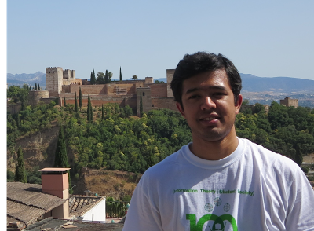

#+TITLE: Shashank Vatedka
#+AUTHOR: Shashank Vatedka
#+OPTIONS: num:nil

#+SETUPFILE: ./org-html-themes-master/setup/theme-bigblow-local.setup

#+BEGIN_COMMENT
#+HTML_HEAD_EXTRA: <link rel="stylesheet" type="text/css" href="readable-bootstrap.css"/>
#+HTML_HEAD_EXTRA: <link rel="stylesheet" type="text/css" href="solarized-light.css"/>
#+SETUPFILE: ../org-html-themes-master/setup/theme-bigblow-local.setup
#+SETUPFILE: ./org-html-themes-master/setup/theme-readtheorg-local.setup
#+END_COMMENT

-----
-----

Hello. I am a postdoctoral fellow at the [[http://www.ie.cuhk.edu.hk/main/index.shtml][Department of Information Engineering]], The Chinese University of Hong Kong. 

* About

I did my Bachelor of Engineering (BE) in ECE at [[http://pes.edu/][PES Institute of Technology]], Bangalore in 2011. 

Subsequently, I did my MSc (Engg) and PhD at the [[http://ece.iisc.ac.in/][Department of Electrical Communication Engineering]], [[http://iisc.ac.in/][Indian Institute of Science]]. 
My advisor was [[http://www.ece.iisc.ernet.in/~nkashyap/][Prof. Navin Kashyap]].

I spent the summer of 2015 as an intern, and 2016-2017 as a research assistant at the [[http://www.inc.cuhk.edu.hk/][Institute of Network Coding]], The Chinese University of Hong Kong.
Since June 2017, I am a postdoctoral fellow at CUHK.

-----
This website was created using [[http://orgmode.org/][org mode]] using [[https://github.com/fniessen/org-html-themes][this theme]] for html export.
-----

* Contact
#+BEGIN_HTML
  
Room 732, Ho Sin Hang Engineering building, Chinese University of Hong Kong, 
     Shatin, New Territories, Hong Kong  
  <strong>email:</strong> shashank [at] ie.cuhk.edu.hk

#+END_HTML
-----
-----

* Publications

** Preprints
   1. Shashank Vatedka and Navin Kashyap, "Improving the performance of nested lattice codes using concatenation,'' ([[http://arxiv.org/abs/1603.08236][arxiv]]).

** Journal
   1. Shashank Vatedka and Navin Kashyap, "Some goodness properties of LDA lattices,"  Problems of Information Transmission, vol 53, no 1, pp 1-29, January 2017 ([[http://link.springer.com/article/10.1134/S003294601701001X][springer]], [[http://arxiv.org/abs/1410.7619][arxiv]]).
   2. Shashank Vatedka, Navin Kashyap and Andrew Thangaraj,  "Secure compute-and-forward in a bidirectional relay," IEEE Transactions on Information Theory, vol 51, no 5, pp 2531-2556, May 2015 ([[http://ieeexplore.ieee.org/xpl/articleDetails.jsp?arnumber=7058433&filter%3DAND%28p_IS_Number%3A7088688%29][ieee]], [[http://arxiv.org/abs/1206.3392][arxiv]]).

** Conference

   1. Shashank Vatedka, Pascal O. Vontobel, "Pattern Maximum Likelihood Estimation of Finite-State Discrete-Time Markov Chains," ISIT 2016, Barcelona, Spain ([[http://ieeexplore.ieee.org/document/7541668/][ieee]], [[./pml_isit2016_extended.pdf][extended version with proofs]]).
   2. Shashank Vatedka, Navin Kashyap, "A Lattice Coding Scheme for Secret Key Generation from Gaussian Markov Tree Sources", ISIT 2016, Barcelona, Spain ([[http://ieeexplore.ieee.org/document/7541352/][ieee]], [[http://arxiv.org/abs/1601.05868][extended version with proofs]], [[https://docs.google.com/viewer?a=v&pid=sites&srcid=ZGVmYXVsdGRvbWFpbnxzaGFzaGFua3ZhdGVka2F8Z3g6Njg1NWJlOWIwYzg0M2NhNw][slides]]).
   3. Shashank Vatedka, Navin Kashyap, "A Capacity-Achieving Coding Scheme for the AWGN Channel with Polynomial Encoding and Decoding Complexity," NCC 2016, Guwahati, India. An updated version containing new results can be found [[http://arxiv.org/abs/1603.08236][here]].
   4. Shashank V, Navin Kashyap, "Nested Lattice Codes for Secure Bidirectional Relaying with Asymmetric Channel Gains," (Invited), ITW 2015, Jerusalem, Israel ([[http://ieeexplore.ieee.org/xpl/articleDetails.jsp?arnumber=7133151][ieee]], [[http://arxiv.org/abs/1506.02152][updated arxiv version]]).
   5. Shashank V, Navin Kashyap, "Some Goodness Properties of LDA Lattices," ITW 2015, Jerusalem, Israel ([[http://ieeexplore.ieee.org/xpls/abs_all.jsp?arnumber=6620731&tag=1][ieee]]) Subsumed by [[https://arxiv.org/abs/1410.7619][journal paper]].
   6. Shashank V, Navin Kashyap, "Lattice Coding for Strongly Secure Compute-and-Forward in a Bidirectional Relay," ISIT 2013, Istanbul, Turkey ([[http://ieeexplore.ieee.org/xpls/abs_all.jsp?arnumber=6620731&tag=1][ieee]]).  Subsumed by [[https://arxiv.org/abs/1410.7619][journal paper]].
   7. Navin Kashyap, Shashank V, Andrew Thangaraj, "Secure Computation in a Bidirectional Relay," ISIT 2012, MIT, Massachusetts. ([[http://ieeexplore.ieee.org/xpls/abs_all.jsp?arnumber=6283036][ieee]]). Subsumed by [[https://arxiv.org/abs/1410.7619][journal paper]].
   8. Vijaya Krishna A, Shashank V, "Mutual Information with Filterbank Equalization for MIMO Frequency Selective Channels," NCC 2011, IISc, Bangalore. ([[http://ieeexplore.ieee.org/xpl/articleDetails.jsp?reload=true&arnumber=5734765][ieee]]).

** Thesis
   - "Lattice codes for secure communication and secret key generation," PhD thesis, Indian Institute of Science, April 2017 ([[https://docs.google.com/viewer?a=v&pid=sites&srcid=ZGVmYXVsdGRvbWFpbnxzaGFzaGFua3ZhdGVka2F8Z3g6MzZlYTA4NTY5ZDAwY2VjNg][pdf]]).

-----
-----

* Miscellaneous

** Blog
I used to blog on wordpress, but am now experimenting with using
org mode for blogging. Still a work in progress.
   - [[http://shashankvatedka.wordpress.com][Wordpress site]]
   - [[./blog/blog_index.html][New blog]]
